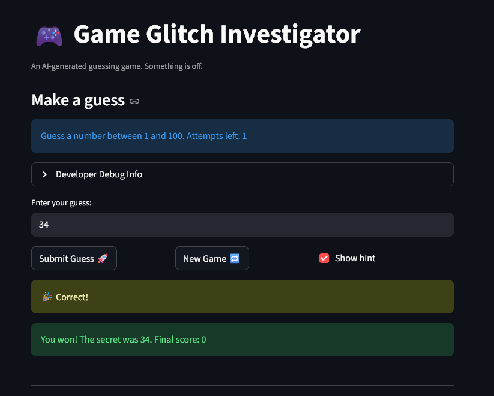

# 🎮 Game Glitch Investigator: The Impossible Guesser

## 🚨 The Situation

You asked an AI to build a simple "Number Guessing Game" using Streamlit.
It wrote the code, ran away, and now the game is unplayable. 

- You can't win.
- The hints lie to you.
- The secret number seems to have commitment issues.

## 🛠️ Setup

1. Install dependencies: `pip install -r requirements.txt`
2. Run the broken app: `python -m streamlit run app.py`

## 🕵️‍♂️ Your Mission

1. **Play the game.** Open the "Developer Debug Info" tab in the app to see the secret number. Try to win.
2. **Find the State Bug.** Why does the secret number change every time you click "Submit"? Ask ChatGPT: *"How do I keep a variable from resetting in Streamlit when I click a button?"*
3. **Fix the Logic.** The hints ("Higher/Lower") are wrong. Fix them.
4. **Refactor & Test.** - Move the logic into `logic_utils.py`.
   - Run `pytest` in your terminal.
   - Keep fixing until all tests pass!

## 📝 Document Your Experience

- [ ] Describe the game's purpose.
   The app is meant to be a number guesing game, where you must correctly guess the number in the specified range. You have a limited number of attempts, and you may allow hints which tell you to either guess a higher or lower number. 
- [ ] Detail which bugs you found.
   The two bugs I encountered and chose to fix had to do with the hints and creating new games. For the hints, I noticed that when guessing I would get the wrong hints. For example, even if I guessed the number 1 which was the lowest in the range, it would still tell me to go lower. The other bug I encountered was trying to start a new game after winning. Upon winning a game, it would say to start a new game. When clicking the New Game button, nothing would happen.
- [ ] Explain what fixes you applied.
   For the wrong hints bug, two fixed were made by Copilot. The first being to pass the input guess as an integer rather than casting it as a string. This was the only fix it provided at first, so after testing the hints it still was wrong. The second fix it suggested corrected the return statements themselves, which gave the inverse hints of what you actually needed to guess.
   For the new game bug, the fix applied correctly reset the game state variables to the proper values, so that the game could read that it was in a new game state and start a new one rather than stay frozen. 

## 📸 Demo

- [  ] [Insert a screenshot of your fixed, winning game here]

## 🚀 Stretch Features

- [ ] [If you choose to complete Challenge 4, insert a screenshot of your Enhanced Game UI here]
